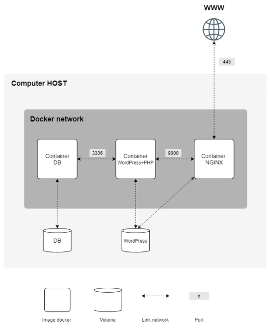

# Welcome to inception 🐋

This project is about using **Docker** and **Docker compose** to create a small multi-containers application with a wordpress website, running with php-fmp, nginx and mariadb.

We need to build the following architecture with a certain set of constraints :

